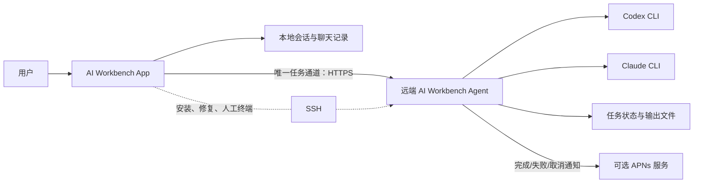
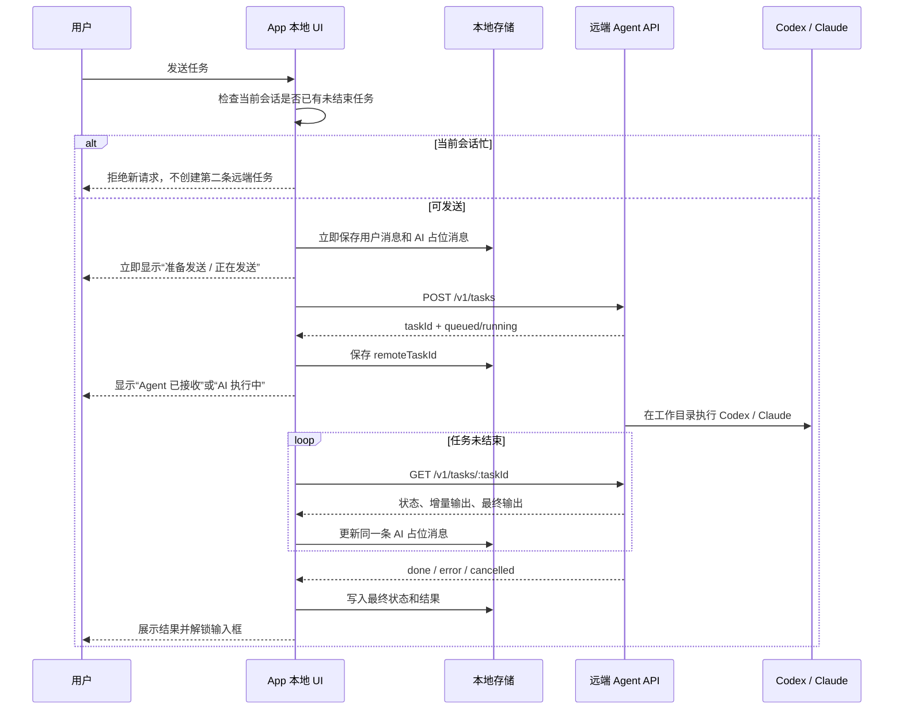

# AI Workbench 当前系统逻辑

更新时间：2026-08-04  
适用范围：当前 `main` 工作区的 Mac、iPhone、iPad、Android 与 Windows 构建。

这份文档以当前代码为准，回答三件事：一条任务如何执行、App 为什么显示某个状态、换设备或回到前台后会发生什么。

## 1. 一句话模型

AI Workbench 是一个把 **本地 App 会话**、**远端机器上的 Agent** 和 **Codex / Claude CLI** 连起来的工作台。

- **会话**：用户看见的一张任务卡，绑定一台机器、一个工作目录、一个 AI 类型和一个远端 `conversationId`。
- **连接**：App 到一台机器的通信能力。多张会话如果指向同一台机器，会复用同一份连接身份和连接管理。
- **任务**：会话内的一次请求。Agent 接收后生成唯一的 `remoteTaskId`，它是恢复、刷新、停止和跨设备查看状态的依据。
- **聊天记录**：完整历史只保存在每台设备本地；远端不作为历史聊天备份。



## 2. 会话、机器与连接

### 2.1 会话唯一性

同步与去重使用以下组合，而不是用户看到的标题：

```text
服务器地址（IP / 域名） + SSH 用户名 + 工作目录 + AI 类型
```

因此，同一个目录下的 Codex 与 Claude 是两个独立会话；改 AI 类型应新建会话，不能把已有会话直接改成另一种 AI。

`conversationId` 是远端 Agent 识别同一会话的稳定标识。标题仅用于用户识别和排序，可以修改，不影响任务归属。

### 2.2 连接复用与任务隔离

| 内容 | 规则 |
|---|---|
| 连接 | 同一机器身份的会话复用连接管理与可用的 Agent HTTP 配置。 |
| 任务 | 每个 `conversationId` 同时只允许一个未结束任务。 |
| 输入框 | 只有当前会话有未结束任务时锁定；其他会话仍可正常使用。 |
| 多设备 | 多台设备可以打开同一会话，但 Agent 会拒绝同一 `conversationId` 的第二个未结束任务。 |

### 2.3 连接状态与任务状态必须分开

顶部状态栏只说明通道：`未连接`、`连接中`、`已连接`、`连接异常`。

聊天中的 AI 占位消息只说明任务：`准备发送`、`正在发送`、`Agent 已接收`、`AI 执行中`、`正在同步结果`、终态。

两者不能互相覆盖。例如：顶部显示“已连接”时，任务仍可能是“AI 执行中”；聊天消息不应再写“连接中”。

## 3. 从发送到结果的完整流程



### 3.1 发送前的防重复规则

按顺序拦截：

1. 同一会话已经在本地提交中。
2. 同一会话已有未结束任务。
3. 配置缺少主机、账号、密码或工作目录。
4. Agent 返回 `busy`，说明另一个设备或当前设备已有同会话任务。

用户消息会先写入本地，再开始网络请求。因此网络慢时，消息也应该立刻出现在聊天中；如果最终没发到远端，该 AI 占位消息会明确变为失败，并允许重新发送。

### 3.2 用户可见任务状态

| 用户看到 | 远端含义 | 输入框 |
|---|---|---|
| 准备发送 / 正在发送 | 本地已保存，正在建立通道或创建任务 | 锁定 |
| Agent 已接收 | `queued` / `preparing` | 锁定 |
| AI 执行中 | `running` 或已收到中间输出 | 锁定 |
| 正在同步结果 | 有 `remoteTaskId`，但 App 正在恢复或查询状态 | 锁定 |
| AI 回复 | `done` 且提取到最终内容 | 解锁 |
| 执行失败 | `error`、登录/额度/网络等明确异常、或没有可展示最终结果 | 解锁 |
| 已取消 | `cancelled` | 解锁 |

“已连接”不是任务成功；它只表示 App 当前可以与机器通信。

## 4. 刷新、停止与前后台恢复

### 4.1 “刷新状态”按钮

刷新不会重新发送，也不会创建新会话。它只对当前消息绑定的 `remoteTaskId` 做一次查询：

1. 显示短暂提示“正在检查远端任务状态”。
2. 调用 Agent HTTPS `GET /v1/tasks/:taskId`。
3. 更新同一条 AI 消息的中间输出、完成、失败或取消状态。
4. Agent HTTPS 不可达时明确显示连接失败，不回退 SSH。
5. 没有 `remoteTaskId` 时，不伪造刷新成功，而是说明这条消息无法远端恢复。

### 4.2 停止当前任务

任务未结束时，发送按钮变为停止按钮。停止会向 Agent 请求取消对应 `remoteTaskId`。已收到的中间输出保留在消息中；任务变为“已取消”后立即解锁输入框。

Agent v40 起，runner PID 与实际命令 PID 分开记录。停止任务、发现 runner 异常退出或卸载 Agent 时，会递归终止该任务的完整进程树，避免 Codex / Claude 子进程残留并继续占用会话。v41 起只允许 Agent HTTPS 任务协议；v42 起支持在无运行任务时清理 Agent 任务历史、会话索引和日志缓存；v43 起主动轮询下载更新后会重启 Agent 服务与 HTTPS 运行时，不再依赖配置中心能够反向访问 Agent 端口。

### 4.3 App 进入后台或被杀掉

App 退出不会终止 Agent 已接受的任务。远端 Agent 继续运行 CLI，并把状态和输出写在自己的任务目录中。

当 App 再次启动、切回某会话或 iPhone/iPad 回到前台时：

1. 只查看**当前会话本地最后一条未结束 Agent 任务**。
2. 若该消息已有 `remoteTaskId`，查询这一个任务。
3. 若没有任务 ID，按 `conversationId` 确认 Agent 是否收到；确认不到才允许用户重新发送。
4. 前台恢复先立即查询一次；仅当这次是连接失败，才在 1.5 秒后重试一次。
5. `done`、`error`、`cancelled` 都是终态，不会重复同步。

不会在回前台时拉远端完整聊天历史，也不会扫描其他会话来阻塞当前界面。

## 5. Agent、HTTP 与 SSH

### 5.1 默认路径

Agent HTTPS 是唯一任务执行方式。首次连接时 App 通过 SSH 探测、安装或修复 Agent，并取得 HTTPS 地址、访问令牌与证书指纹。之后的任务创建、查询和取消全部使用 Agent HTTPS：

| 场景 | 首选通道 | 说明 |
|---|---|---|
| 创建任务 | Agent HTTPS `POST /v1/tasks` | App 很快拿到任务 ID，不等待 AI 完成。 |
| 查询任务 | Agent HTTPS `GET /v1/tasks/:id` | 获取状态、输出和终态。 |
| 取消任务 | Agent HTTPS `POST /v1/tasks/:id/cancel` | 停止远端任务。 |
| 实时事件 | Agent WebSocket `/v1/events` | Agent 支持推送任务变化；查询接口仍是恢复依据。 |
| 安装、修复、查找 CLI、人工终端 | SSH | 不参与 AI 任务执行。 |

Agent HTTPS 不可用、版本过旧或协议不匹配时，App 阻止任务并要求修复或升级，不会静默改走 SSH/tmux。

### 5.2 Agent 自身生命周期

- Agent 运行在每台远端机器上，不属于某一个 App 或某一张会话。
- 一个 Agent 可服务该机器上的多个会话与多个 App 设备。
- Agent 任务按 `conversationId` 串行，避免同一会话被多设备同时干扰。
- Agent 启动时向轻量控制服务登记版本和可访问地址。
- 控制服务发布新版本时调用 Agent 的固定更新接口；离线机器下次登记后再更新。
- Agent 挂掉或机器重启后，任务状态以其任务目录为准；App 下次查询会恢复终态或给出可读异常。

当前发布指针以 `agent/latest.json` 与 `agent/windows-latest.json` 为准，不能通过目录数量判断版本。

## 6. 本地记录与云端配置

### 6.1 本地保存

每台设备本地保存：

- 会话配置、排序、当前选中会话。
- 当前设备的完整聊天记录。
- 文件下载与诊断日志索引。
- 语音、外观和播放偏好。

iPhone/iPad 的敏感连接配置走原生 Keychain；其他运行时也使用平台本地存储。完整聊天记录不上传云端。

### 6.2 云端配置同步

轻量配置服务只保存加密后的会话配置包、版本号和分享记录：

- 用户用同步账号与密码登录。
- App 在本地加密配置后上传；服务端不解析会话正文。
- 下载时按“服务器地址 + SSH 用户名 + 工作目录 + AI 类型”去重。
- 共享/同步包不包含聊天记录。
- 同步配置可包含远端 `conversationId`，用于不同设备继续对应同一远端会话。

## 7. 语音与主 AI 预留能力

语音功能默认关闭。打开后，唤醒词负责从待机进入 ASR，ASR 实时把文本写入输入框；发送仍由同一套任务逻辑处理。TTS 在任务完成后可选择播报“任务完成”或完整结果，并可被语音打断。

未来的主 AI 不直接 SSH 或执行命令，而是：理解自然语言、输出结构化意图、由 App 调用既有会话/任务接口。能力目录与意图契约见 [assistant-runtime.md](./assistant-runtime.md)。

## 8. 代码职责地图

| 领域 | 主要位置 | 责任 |
|---|---|---|
| 应用编排与状态 | `src/app/useWorkbenchController.jsx` | 会话、连接、发送、恢复、同步与动作入口。 |
| 消息状态机 | `src/core/messageLifecycle.js`、`src/app/controllerMessageLifecycle.js` | 任务状态、占位消息去重、消息合并。 |
| Agent 协议 | `src/core/agent.js`、`src/core/agentDirect.js`、`agent/runtime/` | Agent 命令、HTTP API、WebSocket、安装与更新。 |
| SSH 引导与终端 | `src/core/sshReconnect.js`、`src/core/remoteCommands.js` | Agent/CLI 安装修复、人工终端、Linux/Windows 差异。 |
| 聊天与输入 UI | `src/features/chat.jsx`、`src/features/composer.jsx` | 消息展示、刷新、停止、附件与复制。 |
| 平台壳 | `src/platforms/mac/`、`iphone/`、`ipad/`、`android/` | 各平台布局和原生交互，不承载业务状态机。 |
| 配置同步 | `services/config-sync/` | 账号鉴权、加密配置包、分享、Agent 更新登记与 APNs。 |

## 9. 排查顺序

遇到“没响应”时按下面顺序判断，不要只看顶部连接状态：

1. 看 AI 占位消息是否已有 `remoteTaskId`。
2. 有任务 ID：点“刷新状态”，查询同一远端任务；不要重新发送。
3. 没任务 ID：说明 Agent 是否收到尚未确认，检查消息详情或重新发送。
4. 顶部为“连接异常”：等待一次自动重连或手动重连；远端任务可能仍在运行。
5. Agent 可访问但返回 `error` / `done` 无最终结果：查看任务详情与诊断日志，问题通常在远端 CLI 登录、额度、权限或实际执行结果。

## 10. 关联文档

- [请求到响应状态流](./request-response-lifecycle.md)：消息状态与防重复细节。
- [会话状态规范](./session-state-machine.md)：状态命名约束。
- [Agent 发布说明](../agent/README.md)：Agent 版本与发布规则。
- [配置同步服务](../services/config-sync/README.md)：配置、分享、推送和 Agent 控制面。
- [UI 设计规范](./ui-design-system.md)：各平台共享视觉语言和隔离规则。
