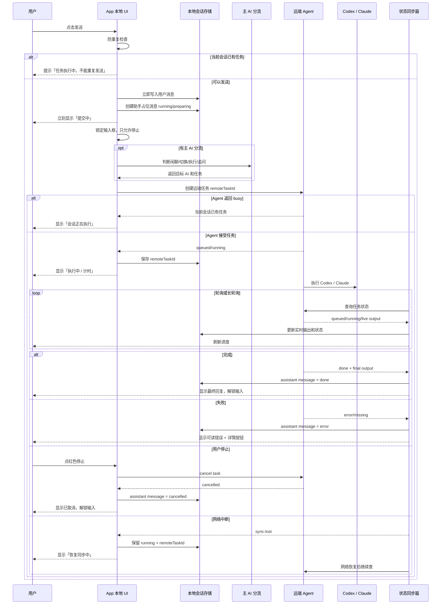

# AI Workbench 请求到响应时序

更新时间：2026-07-22

这份文档说明用户发送一条任务后，App、远端 Agent、Codex/Claude 和本地会话记录之间的状态流转。当前实现以本地会话记录为主，Agent 只同步最后一条带远端任务 ID 的任务状态。

## 状态总览

用户可感知状态收敛为 7 个：

| 阶段 | 用户看到 | App 内部含义 |
|---|---|---|
| 1 | 可输入 | 当前会话没有运行任务，输入框可用 |
| 2 | 防重复检查 | 判断是否重复点击、是否有任务正在提交、是否已有运行任务 |
| 3 | 提交中 | 用户消息已写入本地，正在上传附件、分流或创建远端任务 |
| 4 | 执行中 | Agent 或 SSH 正在等待 Codex/Claude 结果 |
| 5 | 恢复同步中 | App 暂时查不到远端状态，但会保留任务并继续同步 |
| 6 | 状态待确认 | App 没拿到任务 ID，先锁住输入，避免重复提交 |
| 7 | 结束 | 已完成、执行失败、已取消、同步超时之一，输入框解锁 |

底层远端状态包括：

| 状态 | 含义 |
|---|---|
| `preparing` | App 正在准备任务 |
| `queued` | Agent 已接受任务，等待执行 |
| `running` | Agent 或远端工具正在执行 |
| `busy` | 同一会话已有任务，新请求被拒绝 |
| `done` | 远端任务完成 |
| `error` | 远端任务失败 |
| `cancelled` | 任务已取消 |
| `missing` | 远端任务不存在或已丢失 |
| `sync-lost` | App 有任务 ID，但暂时无法同步远端状态 |
| `sync-lost-no-task-id` | App 没拿到任务 ID，无法自动恢复，只能提示用户检查 |
| `sync-timeout` | 同步等待超过 2 小时 |
| `ssh-waiting` | SSH 直连正在等待命令返回 |

## 主时序图

## 防重复检查规则

发送前按顺序执行 5 层检查：

| 顺序 | 规则 | 拦截提示 |
|---|---|---|
| 1 | 900ms 内重复点击 | 已收到点击，请不要重复提交 |
| 2 | App 正在处理其它操作，`busyRef` 或 `pendingActionRef` 为真 | 上一条操作还在处理 |
| 3 | 当前会话正在提交，`sendingServerIdsRef` 已包含该会话 | 正在提交，请稍等 |
| 4 | 当前会话已有运行任务，`server.task.state = running` | 任务执行中，不能重复发送 |
| 5 | 连接配置或工作目录不完整 | 连接信息不完整 / 请先选择一个工作目录 |

通过防重复检查后，App 才会：

1. 清空输入框。
2. 写入用户消息。
3. 写入助手占位消息。
4. 将当前会话标记为 `running`。
5. 开始远端执行。

## Agent 与 SSH 的区别

| 通道 | 是否可后台恢复 | 状态来源 | 适用场景 |
|---|---|---|---|
| Agent 代理 | 是 | `remoteTaskId` + Agent 状态文件 | 默认通道，适合长任务、多设备同步 |
| SSH 直连 | 否 | 当前 SSH 命令返回 | Agent 不可用时降级，适合短任务 |

Agent 连续 2 次启动后台 runner 失败时，当前实现会自动降级到 SSH 直连。

## 多设备状态一致性

多设备能否看到同一个状态，关键看是否使用同一个会话标识：

| 维度 | 当前规则 |
|---|---|
| 会话唯一标识 | `host + username + workdir + agentId` |
| 用户感知标题 | 会话名称只是展示，不作为唯一键 |
| 任务恢复依据 | Agent 任务需要 `remoteTaskId` |
| 本地聊天记录 | 每个端本地保存完整记录 |
| 跨端同步 | 当前只同步最后一条带 `remoteTaskId` 的任务状态 |

如果某个端没有拿到 `remoteTaskId`，它只能进入 `sync-lost-no-task-id`，提示用户检查状态，不能可靠自动恢复。

## 推荐的 UI 简化

为了让用户更容易理解，建议把复杂底层状态压缩成 3 个运行中状态：

| UI 文案 | 包含底层状态 |
|---|---|
| 提交中 | `preparing`、创建远端任务中 |
| 执行中 | `queued`、`running`、`ssh-waiting` |
| 恢复同步中 | `sync-lost`、网络恢复后的重新查询 |

终态只保留 4 个：

| UI 文案 | 包含底层状态 |
|---|---|
| 已完成 | `done` |
| 执行失败 | `error`、`missing`、无最终结果 |
| 已取消 | `cancelled` |
| 同步超时 | `sync-timeout` |
