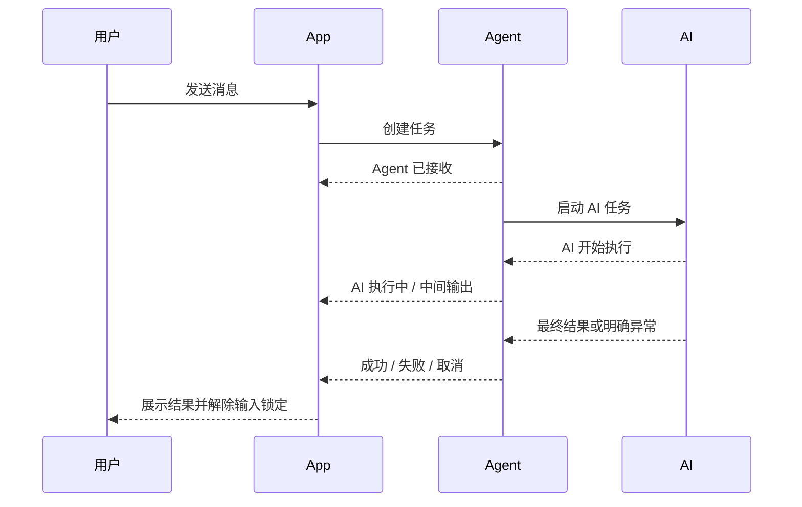

# 会话与任务状态规范

> 当前实现总览请先看 [current-system-logic.md](./current-system-logic.md)。本文件保留状态命名参考；连接恢复与前后台同步规则以总览和代码为准。

## 核心原则

- 会话连接状态只描述当前 App 进程是否验证过该会话的远端连接。
- Agent 健康状态只描述目标机器上的 Agent 是否可用。
- 任务状态只描述一条用户请求从 App 到 Agent、AI，再返回 App 的处理进度。
- 三种状态互不覆盖。Agent 可用不等于会话已连接，AI 执行中也不等于连接中。

## App 启动与恢复

1. App 每次启动时，所有持久化的连接状态统一重置为“未连接”。
2. App 自动连接当前选中的会话，其他会话保持“未连接”。
3. 连接成功后，App 按 `conversationId` 向 Agent 查询最后一条任务。
4. 最后一条任务为成功、失败或取消时，直接恢复终态和结果。
5. 最后一条任务仍在排队或执行时，恢复为运行状态并继续轮询。
6. App 被关闭只会断开 App 连接，不会终止 Agent 后台任务。

## 请求状态

## 用户可见状态

| 阶段 | 消息区状态 | 会话连接状态 | 输入 |
|---|---|---|---|
| App 本地提交 | 正在发送 | 已连接 | 锁定 |
| Agent 创建任务成功 | Agent 已接收 | 已连接 | 锁定 |
| Agent 正在启动 AI | 正在交给 AI | 已连接 | 锁定 |
| AI 进程已启动 | AI 执行中 | 已连接 | 锁定 |
| App 暂时失联 | 恢复同步中 | 连接中断/重连中 | 锁定 |
| 成功 | AI 回复 | 已连接 | 解锁 |
| 失败（含网络、Token、账号等明确结果） | 执行失败及原因 | 已连接或连接失败 | 解锁 |
| 取消 | 已取消 | 已连接 | 解锁 |

## 防重复

- 同一 `conversationId` 同时只允许一个未结束任务。
- 本地任务处于运行状态时禁止再次发送。
- Agent 返回 `busy` 时，新请求视为未提交，不创建第二条远端任务。
- App 失联但任务 ID 已存在时只同步原任务，不能重发。
- App 缺少任务 ID 时先按 `conversationId` 恢复最后任务，确认不存在后才允许重新发送。
